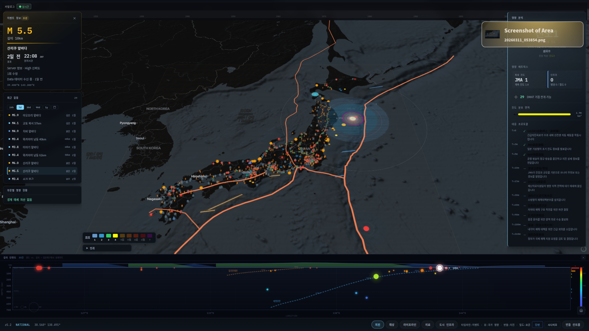
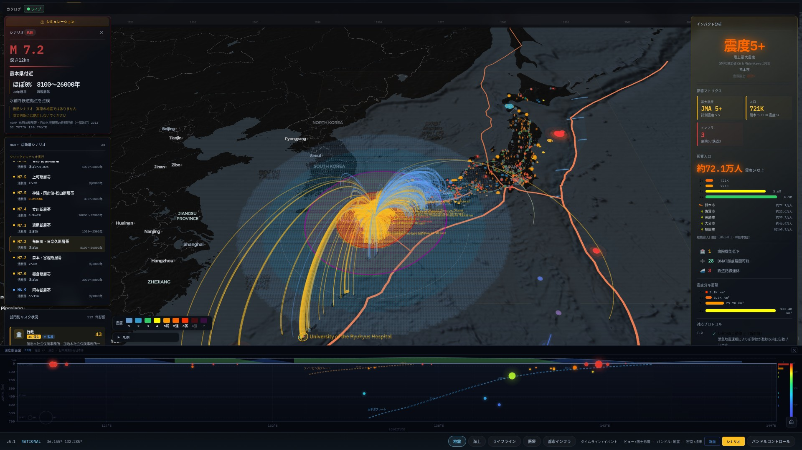
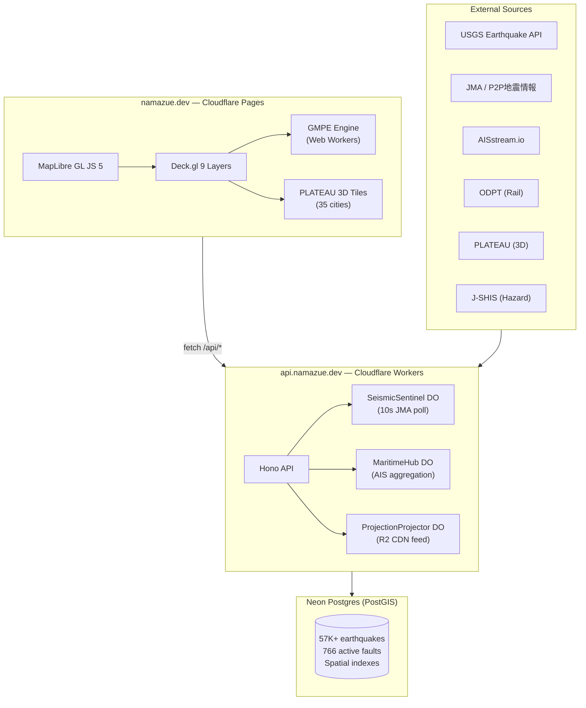

<p align="center">
  
</p>

<h1 align="center">Namazue Console</h1>

<p align="center">
  <b>Japan-wide earthquake intelligence console for infrastructure operators</b>
  <br />
  Real-time seismic monitoring → GMPE intensity computation → infrastructure impact assessment
</p>

<p align="center">
  <a href="https://github.com/Hybirdss/namazue-console/actions/workflows/ci.yml"></a>
  <a href="LICENSE"></a>
  <a href="https://namazue.dev"></a>
  <a href="https://www.typescriptlang.org/"></a>
  <a href="https://maplibre.org/"></a>
  <a href="https://deck.gl/"></a>
  <a href="https://github.com/sacridini/Awesome-Geospatial"></a>
</p>

---

## What is this?

Namazue is a spatial operations console that turns earthquake events into **operational consequences** across a living infrastructure map of Japan. When an earthquake occurs, the system computes ground motion intensity using peer-reviewed GMPE equations, propagates P/S wave fronts in real time, evaluates structural fragility across 13 infrastructure asset classes, and surfaces prioritized operator actions.

Built for infrastructure operators (port authorities, rail companies, hospitals, resilience teams) — not general consumers.

> **Try it live:** [namazue.dev](https://namazue.dev)

<p align="center">
  
</p>
<p align="center"><i>M7.2 scenario: intensity field propagation, infrastructure bearing lines, and real-time exposure scoring</i></p>

## Features

### Seismic Engine
- **GMPE intensity computation** — Si & Midorikawa (1999, revised 2006) with Vs30 site amplification, fault-type corrections, and deep earthquake saturation
- **P/S wave propagation** — real-time animated wave fronts with depth-corrected velocity
- **Nankai Trough scenario engine** — multi-segment rupture simulation using SharedArrayBuffer parallel computation
- **Intensity grid** — per-cell Vs30 microzonation accuracy via Web Workers

### Data Layers
- **PLATEAU 3D buildings** — 3D Tiles for 35 Japanese cities, colored by computed intensity
- **AIS vessel tracking** — real-time maritime positions via AISstream.io
- **Rail network status** — ODPT open data feed
- **Power grid & telecom** — substation and hub locations with exposure scoring
- **766 active fault lines** — from AIST active fault database

### Operations Intelligence
- **Fragility assessment** — probit curves calibrated on Kobe 1995, Niigata-Chuetsu 2004, Tohoku 2011, Kumamoto 2016, Noto 2024
- **13 infrastructure asset classes** — port, rail hub, hospital, power substation, water facility, telecom hub, nuclear plant, airport, dam, LNG terminal, government EOC, evacuation site, building cluster
- **Priority generation** — clear / watch / priority / critical severity with domain-specific operator actions
- **Multi-source event truth** — conflict detection across USGS and JMA with confidence scoring

### Console UX
- **Operator-grade dark UI** — frosted glass panels, IBM Plex Mono data readouts, JMA severity color scale
- **Keyboard-driven workflow** — `Cmd+K` command palette, full keyboard navigation
- **Depth cross-section** — auto-triggers at 45° map pitch, shows seismological profile
- **PWA** — offline-capable with stale-while-revalidate cache
- **i18n** — Japanese, English, Korean

## Architecture



## Tech Stack

| Layer | Technology |
|---|---|
| **Spatial** | MapLibre GL JS 5 + Deck.gl 9 + PMTiles |
| **3D** | PLATEAU 3D Tiles via `@loaders.gl/3d-tiles` |
| **Engine** | Si & Midorikawa 1999 GMPE, Web Workers, SharedArrayBuffer |
| **Frontend** | Vanilla TypeScript + DOM (zero frameworks) |
| **API** | Cloudflare Workers + Hono |
| **Real-time** | Durable Objects (SeismicSentinel, MaritimeHub, ProjectionProjector) |
| **Database** | Neon Postgres with PostGIS |
| **CDN** | Cloudflare R2 snapshot feed |
| **Build** | Vite 7 + Vitest |

## Quick Start

```bash
git clone https://github.com/Hybirdss/namazue-console.git
cd namazue-console
npm install
cp .env.example .env    # fill in API keys
npm run dev              # http://localhost:5173
```

See [`.env.example`](.env.example) for required environment variables.

## Project Structure

```
namazue-console/
├── apps/
│   ├── globe/                # Spatial console (CF Pages → namazue.dev)
│   │   └── src/
│   │       ├── core/         # MapLibre + Deck.gl init, shell, panel system
│   │       ├── data/         # API clients, stores, real-time data managers
│   │       ├── engine/       # GMPE, wave propagation, Nankai model
│   │       ├── i18n/         # Translations (ja, en, ko)
│   │       ├── layers/       # Plugin data layers (seismic, maritime, lifelines, medical, built-env)
│   │       ├── ops/          # Operations intelligence (fragility, exposure, priorities)
│   │       ├── panels/       # Floating panels (22 panels)
│   │       ├── presentation/ # Operator view rendering components
│   │       ├── utils/        # Coordinate math, color scales, formatting
│   │       └── types.ts      # Shared type contract
│   └── worker/               # API server (CF Workers → api.namazue.dev)
│       └── src/
│           ├── routes/       # Hono API routes
│           └── lib/          # Durable Objects, tools
├── packages/
│   └── db/                   # Drizzle schema + PostGIS queries
├── tools/                    # Data pipeline scripts
└── docs/
    ├── current/              # DESIGN.md (product source of truth)
    ├── reference/            # GMPE equations, JMA intensity colors, historical presets
    └── technical/            # Engine docs, data source reference
```

## Data Sources

| Source | Data | Update Frequency |
|---|---|---|
| [USGS Earthquake API](https://earthquake.usgs.gov/fdsnws/event/1/) | Global earthquake catalog | Real-time |
| [JMA](https://www.jma.go.jp/) / [P2P地震情報](https://www.p2pquake.net/) | Japan-specific seismic data | 10-second poll |
| [AISstream.io](https://aisstream.io/) | Live vessel positions | Real-time WebSocket |
| [ODPT](https://developer.odpt.org/) | Rail network status | Periodic |
| [J-SHIS](https://www.j-shis.bosai.go.jp/) | Seismic hazard grid, Vs30 | Static |
| [PLATEAU](https://www.mlit.go.jp/plateau/) | 3D building models (35 cities) | Static |
| [AIST Active Faults](https://gbank.gsj.jp/activefault/) | 766 active fault geometries | Static |
| [GSI](https://www.gsi.go.jp/) | Elevation, slope data | Static |

## GMPE Engine

The core intensity engine implements the **Si & Midorikawa (1999, revised 2006)** Ground Motion Prediction Equation — the standard GMPE used by Japan's National Seismic Hazard Maps.

Key parameters:
- **Vs30 site amplification** — default 270 m/s (Japanese urban alluvial), per-cell grid support
- **Fault-type corrections** — crustal, subduction interface, intraslab
- **Depth saturation** — >60 km deep earthquake corrections
- **Mw cap** — 9.5 for mega-earthquake extrapolation safety

Validation target: within ±1.0 JMA intensity of historical actuals.

See [`docs/technical/GMPE_ENGINE.md`](docs/technical/GMPE_ENGINE.md) for the full mathematical reference.

## Contributing

See [CONTRIBUTING.md](CONTRIBUTING.md) for development setup, code style, and PR guidelines.

## License

[MIT](LICENSE) &copy; 2026 Yunsu Kim
